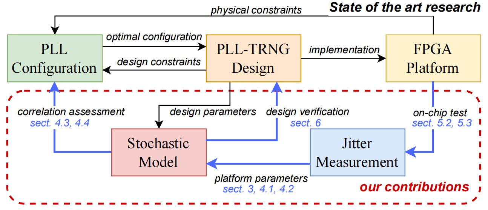
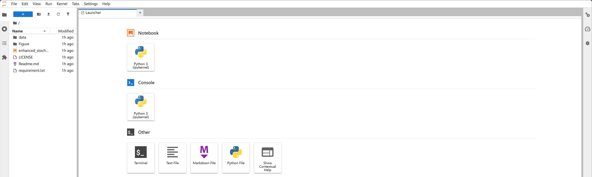
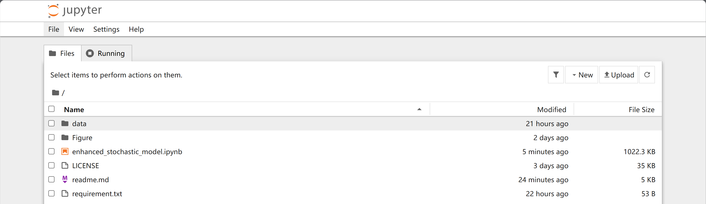

[](https://mybinder.org/v2/gh/ybhphoenix/PLL-TRNG-Characterization/HEAD)

[](https://www.python.org/)
[](https://www.jupyter.org/)
# On the Characterization of Phase Noise for the Robust and Resilient PLL-TRNG Design

Repository for the paper:
**[On the Characterization of Phase Noise for the Robust and Resilient PLL-TRNG Design]()**
*[TCHES 2025 Issue 3](https://ches.iacr.org/2025/acceptedpapers.php)*

## 📜 Repository Overview

### 🔍 Paper Abstract
A true random number generator (TRNG) is a critical component in ensuring the security of cryptographic systems. Among TRNG implementations, the phase-locked loop-based TRNG (PLL-TRNG) is a widely adopted solution for FPGA platforms due to the availability of a stochastic model. In the previous study, this stochastic model was based on analog noise signals, which potentially led to an oversimplification of the PLL physical process and resulted in an overestimation of entropy. To address this limitation, **we extract key platform-specific parameters of the PLL** and **develop a new stochastic model tailored for multi-output PLL-TRNGs**. For the first time, we **reveal the effect of the PLL's bandwidth on the correlation of sampling points** and introduce a method for quantitatively controlling sampling point correlations. Finally, we validate the model through on-chip jitter measurements. Experimental results show that the proposed stochastic model accurately describes the behavior of the PLL-TRNG and provides the most conservative entropy lower bound, with a **1.8-fold improvement in jitter resolution**.

<figure>

<figcaption style="text-align:center">Figure: Overview of the paper</figcaption>
</figure>

### 👥 Authors & Affiliations

- **Ziheng Ma**, [BNRist](https://www.bnrist.tsinghua.edu.cn/bnristen/About1/Introduction.htm), [SIC](https://www.sic.tsinghua.edu.cn/en/About/Introduction.htm), Tsinghua University, Beijing, China
- **Bohan Yang**, [BNRist](https://www.bnrist.tsinghua.edu.cn/bnristen/About1/Introduction.htm), [SIC](https://www.sic.tsinghua.edu.cn/en/About/Introduction.htm), Tsinghua University, Beijing, China
- **Wenping Zhu**, [BNRist](https://www.bnrist.tsinghua.edu.cn/bnristen/About1/Introduction.htm), [SIC](https://www.sic.tsinghua.edu.cn/en/About/Introduction.htm), Tsinghua University, Beijing, China
- **Hanning Wang**, [BNRist](https://www.bnrist.tsinghua.edu.cn/bnristen/About1/Introduction.htm), [SIC](https://www.sic.tsinghua.edu.cn/en/About/Introduction.htm), Tsinghua University, Beijing, China
- **Yi Ouyang**, [BNRist](https://www.bnrist.tsinghua.edu.cn/bnristen/About1/Introduction.htm), [SIC](https://www.sic.tsinghua.edu.cn/en/About/Introduction.htm), Tsinghua University, Beijing, China
- **Min Zhu**, [MUCSE](https://mucse.com/en/about/about.aspx), Wuxi, China
- **Leibo Liu**, [BNRist](https://www.bnrist.tsinghua.edu.cn/bnristen/About1/Introduction.htm), [SIC](https://www.sic.tsinghua.edu.cn/en/About/Introduction.htm), Tsinghua University, Beijing, China

## 🗂 Repository Structure

```text
├── 📂Figure/ # visual assets directory
│   └── Overview.png
├── 📄LICENSE # software license file
├── 📄readme.md # primary project documentation
├── 📂data/ # directory containing all data files
│   ├── 📂correlation_L0/
│   ├── 📂correlation_bandwidth/
│   ├── 📂correlation_matrix/
│   ├── 📂correlation_output/
│   └── 📂entropy_BW/
├── 📄enhanced_stochastic_model.ipynb # the main script
├── 📄requirement.txt # Python package dependencies
```

## Code Execution

### Quick Online Trial (via Binder)  
1. Click the Binder badge below:  
   [](https://mybinder.org/v2/gh/ybhphoenix/PLL-TRNG-Characterization/HEAD)
2. Wait for the environment to build (first-time may take 3-5 minutes)
3. The Jupyter interface will open automatically when ready

<figure>

<figcaption style="text-align:center">Figure: Online Setup</figcaption>
</figure>

### Local Setup

1. Install Python 3:
```bash
python3 --version
```  
 Ensure you have Python 3.9 or later installed. If not installed, download from [python.org](https://www.python.org/downloads/).  

2. Install Required Libraries  
```bash
pip install numpy matplotlib seaborn gmpy2 prettytable scipy jupyter notebook
```

3. Launch Jupyter Notebook  
```bash
jupyter notebook
```  
This will open your default browser at `http://localhost:8888`.

<figure>

<figcaption style="text-align:center">Figure: Local Setup</figcaption>
</figure>

## 📩 Contact

Please contact Ziheng Ma (mazh24@mails.tsinghua.edu.cn) for:

- Technical questions about the paper
- Bug reports in code/data
- Potential research extensions

## ⚖️ License

Copyright (c) 2025, Ziheng Ma, Leibo Liu. All rights reserved.

Please see `LICENSE` for further license instructions.
